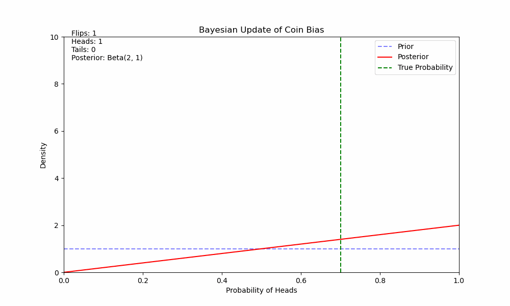
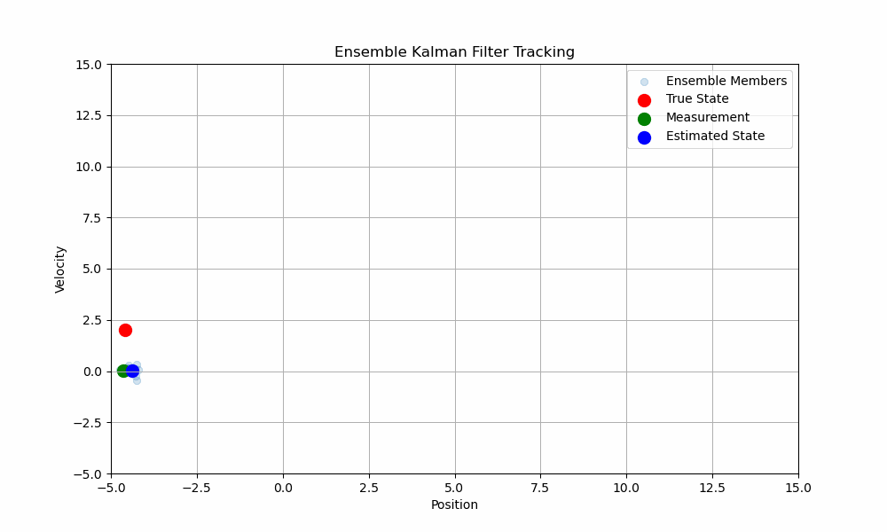
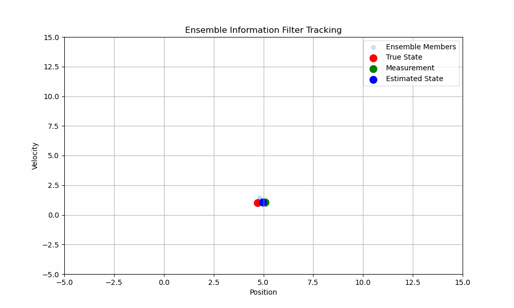

# Ensemble-Information-Filter
An implementation of he Ensemble Information Filter in Python for learning purpose. Link to paper: https://arxiv.org/pdf/2501.09016

## Example of Bayesian update process:

Estimating the bias of a coin based on observed coin flips, using the Beta distribution as prio and updates 
the posterior distribution based on counted coin flips.

## Ensemble Kalman filter

The model has two state variables:
1. **Position** (`x`)
2. **Velocity** (`v`)

The EnKF tracks these variables over time using:
- A **prediction step** to propagate the state ensemble forward in time based on a constant velocity model.
- An **update step** to correct the state ensemble using noisy position measurements.

### Prediction Step
The state transition model assumes constant velocity:
\[
\mathbf{x}_{t+1} = \mathbf{F} \mathbf{x}_t + \mathbf{q}
\]
Where:
- \(\mathbf{x}_t = \begin{bmatrix} x \\ v \end{bmatrix}\) is the state vector.
- \(\mathbf{F} = \begin{bmatrix} 1 & \Delta t \\ 0 & 1 \end{bmatrix}\) is the state transition matrix.
- \(\mathbf{q}\) is the process noise, modeled as Gaussian noise.

### Update Step
The measurement model assumes we only observe the position:
\[
\mathbf{z}_t = \mathbf{H} \mathbf{x}_t + \mathbf{r}
\]
Where:
- \(\mathbf{z}_t\) is the measurement (position).
- \(\mathbf{H} = \begin{bmatrix} 1 & 0 \end{bmatrix}\) is the measurement matrix.
- \(\mathbf{r}\) is the measurement noise, modeled as Gaussian noise.

The Kalman gain is computed as:
\[
\mathbf{K} = \mathbf{P} \mathbf{H}^T (\mathbf{H} \mathbf{P} \mathbf{H}^T + \mathbf{R})^{-1}
\]
Where:
- \(\mathbf{P}\) is the covariance matrix of the state ensemble.
- \(\mathbf{R}\) is the measurement noise covariance.

The state ensemble is updated as:
\[
\mathbf{x}_i = \mathbf{x}_i + \mathbf{K} (\mathbf{z}_i - \mathbf{H} \mathbf{x}_i)
\]

## Example Details

- **State Ensemble**: The filter uses an ensemble of 10 state vectors, initialized with random positions and velocities.
- **Process Noise**: Gaussian noise with standard deviation 0.1 is added during the prediction step.
- **Measurement Noise**: Gaussian noise with standard deviation 0.2 is added to the position measurements.

## Ensemble Information filter

The EnIF operates in the **information space**, using the precision matrix (inverse covariance matrix) to represent uncertainty, which allows for enforcing sparsity and leveraging conditional independence.

The model has two state variables:
1. **Position** (`x`)
2. **Velocity** (`v`)

The EnIF tracks these variables over time using:
- A **prediction step** to propagate the state ensemble forward in time based on a constant velocity model.
- An **update step** to correct the state ensemble using noisy position measurements, while explicitly updating the precision matrix.

### Prediction Step
The state transition model assumes constant velocity:
\[
\mathbf{x}_{t+1} = \mathbf{F} \mathbf{x}_t + \mathbf{q}
\]
Where:
- \(\mathbf{x}_t = \begin{bmatrix} x \\ v \end{bmatrix}\) is the state vector.
- \(\mathbf{F} = \begin{bmatrix} 1 & \Delta t \\ 0 & 1 \end{bmatrix}\) is the state transition matrix.
- \(\mathbf{q}\) is the process noise, modeled as Gaussian noise.

The precision matrix is propagated as:
\[
\mathbf{\Lambda}_{t+1} = (\mathbf{F} \mathbf{\Lambda}_t^{-1} \mathbf{F}^T + \mathbf{Q})^{-1}
\]
Where:
- \(\mathbf{\Lambda}_t = \mathbf{P}_t^{-1}\) is the precision matrix (inverse covariance).
- \(\mathbf{Q}\) is the process noise covariance.

### Update Step
The measurement model assumes we only observe the position:
\[
\mathbf{z}_t = \mathbf{H} \mathbf{x}_t + \mathbf{r}
\]
Where:
- \(\mathbf{z}_t\) is the measurement (position).
- \(\mathbf{H} = \begin{bmatrix} 1 & 0 \end{bmatrix}\) is the measurement matrix.
- \(\mathbf{r}\) is the measurement noise, modeled as Gaussian noise.

The precision matrix is updated explicitly:
\[
\mathbf{\Lambda}_{t+1} = \mathbf{\Lambda}_t + \mathbf{H}^T \mathbf{R}^{-1} \mathbf{H}
\]
Where:
- \(\mathbf{R}\) is the measurement noise covariance.

The Kalman gain in the information space is:
\[
\mathbf{K} = \mathbf{\Lambda}_t^{-1} \mathbf{H}^T (\mathbf{H} \mathbf{\Lambda}_t^{-1} \mathbf{H}^T + \mathbf{R})^{-1}
\]

The state ensemble is updated as:
\[
\mathbf{x}_i = \mathbf{x}_i + \mathbf{K} (\mathbf{z}_i - \mathbf{H} \mathbf{x}_i)
\]

### Example Details

- **State Ensemble**: The filter uses an ensemble of 10 state vectors, initialized with random positions and velocities.
- **Precision Matrix**: The precision matrix is explicitly updated during both the prediction and update steps.
- **Process Noise**: Gaussian noise with standard deviation 0.1 is added during the prediction step.
- **Measurement Noise**: Gaussian noise with standard deviation 0.2 is added to the position measurements.

