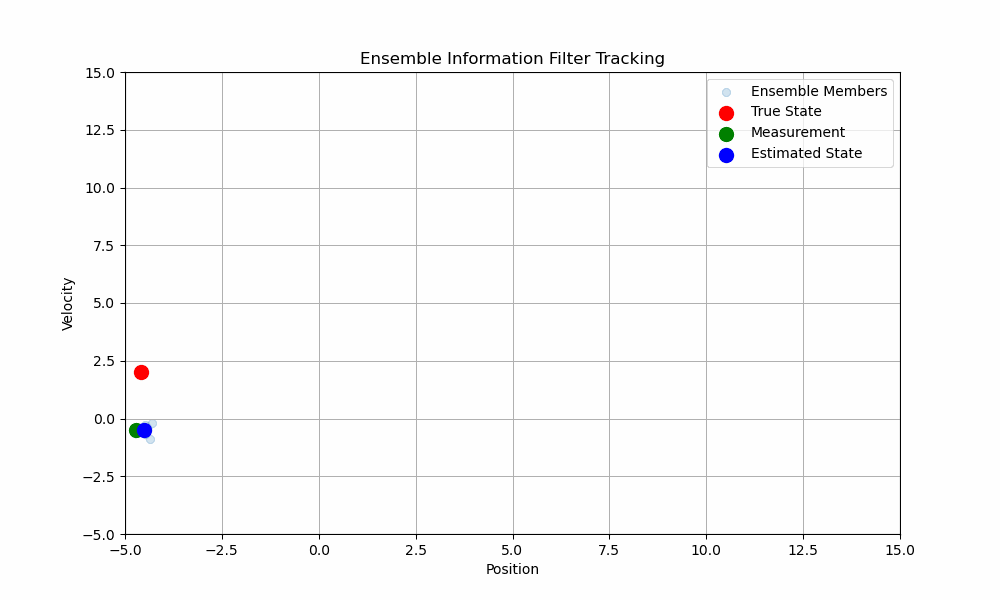

# Ensemble-Information-Filter
An implementation of the Ensemble Information Filter in Python for learning purpose. Link to paper: https://arxiv.org/pdf/2501.09016

## Example of Bayesian update process:

Estimating the bias of a coin based on observed coin flips, using the Beta distribution as prio and updates 
the posterior distribution based on counted coin flips.


## Ensemble Kalman filter

The model has two state variables:
1. **Position** (`x`)
2. **Velocity** (`v`)

The EnKF tracks these variables over time using:
- A **prediction step** to propagate the state ensemble forward in time based on a constant velocity model.
- An **update step** to correct the state ensemble using noisy position measurements.

### Prediction Step
The state transition model assumes constant velocity:
```math
$$
\mathbf{x}_{t+1} = \mathbf{F} \mathbf{x}_t + \mathbf{q}
$$
```
Where:
- $`\mathbf{x}_t = \begin{bmatrix} x \\ v \end{bmatrix}`$ is the state vector.
- $`\mathbf{F} = \begin{bmatrix} 1 & \Delta t \\ 0 & 1 \end{bmatrix}`$ is the state transition matrix.
- $`\mathbf{q}`$ is the process noise, modeled as Gaussian noise. It models uncertainties in the system's dynamics. The fact that the state transition (e.g., motion of an object) is not perfectly predictable due unmodeled dynamics.

### Update Step
The measurement model assumes we only observe the position:
```math
$$
\mathbf{z}_t = \mathbf{H} \mathbf{x}_t + \mathbf{r}
$$
```
Where:
- $`\mathbf{z}_t`$ is the measurement (position).
- $`\mathbf{H} = \begin{bmatrix} 1 & 0 \end{bmatrix}`$ is the measurement matrix.
- $`\mathbf{r}`$ is the measurement noise, modeled as Gaussian noise. It models inaccuracies in the observations. It models the fact that sensors or measurement devices are not perfect and introduce errors.

The Kalman gain is computed as:
```math
$$
\mathbf{K} = \mathbf{Q} \mathbf{H}^T (\mathbf{H} \mathbf{Q} \mathbf{H}^T + \mathbf{R})^{-1}
$$
```
Where:
- $`Q`$ is the process noise covariance matrix. It quantifies the uncertainty in the filter's estimate of the state variables (e.g., position and velocity).
  - A larger Q indicates that the model's predictions are less reliable due to higher uncertainty in the system's dynamics (e.g., unmodeled forces or random disturbances). The Kalman filter will rely more on the measurements to correct the state estimate, even if the measurements are noisy. A large Q inflates the predicted state covariance matrix
  - update of Q in the prediction step: $`\mathbf{Q}_{t+1} = \mathbf{F} \mathbf{Q}_t \mathbf{F}^T + \mathbf{Q}`$
  - update of Q in the update step: $`\mathbf{Q}_{t+1} = (\mathbf{I} - \mathbf{K} \mathbf{H}) \mathbf{Q}_t`$
- $`R`$ is the measurement (observation) noise covariance. It reflects the uncertainty in the sensor measurements or inaccuracy present in the observations. A larger $`R`$ means the measurements are less reliable, so the filter relies more on the model's prediction. $`R`$ is predefined by the sensor characteristics.
- $`K`$ Kalmar gain - a higher K means the filter gives more weight to the measurement during update. 

The state ensemble is updated as:
```math
$$
\mathbf{x}_i = \mathbf{x}_i + \mathbf{K} (\mathbf{z}_i - \mathbf{H} \mathbf{x}_i)
$$
```

## Example Details

- **State Ensemble**: The filter uses an ensemble of 10 state vectors, initialized with random positions and velocities of -5.0 and 2.0
- **Process Noise**: Gaussian noise with standard deviation 0.1 is added during the prediction step.
- **Measurement Noise**: Gaussian noise with standard deviation 0.2 is added to the position measurements.


## Ensemble Information filter

The EnIF operates in the **information space**, using the precision matrix (inverse covariance matrix) to represent uncertainty, which allows for enforcing sparsity and leveraging conditional independence.

The model has two state variables:
1. **Position** (`x`)
2. **Velocity** (`v`)

The EnIF tracks these variables over time using:
- A **prediction step** to propagate the state ensemble forward in time based on a constant velocity model.
- An **update step** to correct the state ensemble using noisy position measurements, while explicitly updating the precision matrix.

### Prediction Step
The state transition model assumes constant velocity:
```math
$$
\mathbf{x}_{t+1} = \mathbf{F} \mathbf{x}_t + \mathbf{q}
$$
```
Where:
- $`\mathbf{x}_t = \begin{bmatrix} x \\ v \end{bmatrix}`$ is the state vector.
- $`\mathbf{F} = \begin{bmatrix} 1 & \Delta t \\ 0 & 1 \end{bmatrix}`$ is the state transition matrix.
- $`\mathbf{q}`$ is the process noise, modeled as Gaussian noise.

The precision matrix is propagated as:
```math
$$
\mathbf{\Lambda}_{t+1} = (\mathbf{F} \mathbf{\Lambda}_t^{-1} \mathbf{F}^T + \mathbf{Q})^{-1}
$$
```
Where:
- $`\mathbf{\Lambda}_t = \mathbf{P}_t^{-1}`$ is the precision matrix (inverse covariance).
- $`\mathbf{Q}`$ is the process noise covariance.

### Update Step
The measurement model assumes we only observe the position:
```math
$$
\mathbf{z}_t = \mathbf{H} \mathbf{x}_t + \mathbf{r}
$$
```
Where:
- $`\mathbf{z}_t`$ is the measurement (position).
- $`\mathbf{H} = \begin{bmatrix} 1 & 0 \end{bmatrix}`$ is the measurement matrix.
- $`\mathbf{r}`$ is the measurement noise, modeled as Gaussian noise.

The precision matrix is updated explicitly:
```math
$$
\mathbf{\Lambda}_{t+1} = \mathbf{\Lambda}_t + \mathbf{H}^T \mathbf{R}^{-1} \mathbf{H}
$$
```
Where:
- $`\mathbf{R}`$ is the measurement noise covariance.

The Kalman gain in the information space is:
```math
$$
\mathbf{K} = \mathbf{\Lambda}_t^{-1} \mathbf{H}^T (\mathbf{H} \mathbf{\Lambda}_t^{-1} \mathbf{H}^T + \mathbf{R})^{-1}
$$
```

The state ensemble is updated as:
```math
$$
\mathbf{x}_i = \mathbf{x}_i + \mathbf{K} (\mathbf{z}_i - \mathbf{H} \mathbf{x}_i)
$$
```

### Example Details

- **State Ensemble**: The filter uses an ensemble of 10 state vectors, initialized with random positions and velocities.
- **Precision Matrix**: The precision matrix is explicitly updated during both the prediction and update steps.
- **Process Noise**: Gaussian noise with standard deviation 0.1 is added during the prediction step.
- **Measurement Noise**: Gaussian noise with standard deviation 0.2 is added to the position measurements.


